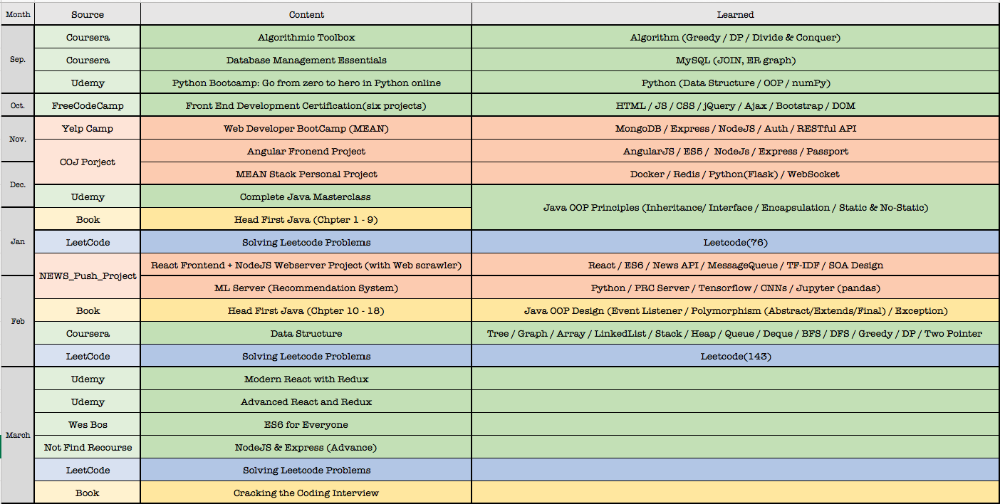

# 365 Days of Codes Project

## Monthly Record

| Month | Source | Content | Learned |
|:-----:|:------:|:-------:|:-------:|
| Sep. |Coursera |Algorithmic Toolbox |Algorithm (Greedy / DP / Divide & Conquer) |
| |Coursera |Database Management Essentials | MySQL (JOIN, ER graph) |
| |Udemy |Python Bootcamp: Go from zero to hero in Python online |Python (Data Structure / OOP / numPy) |
|Oct.  |FreeCodeCamp |Front End Development Certification(six projects) | HTML / JS / CSS / jQuery / Ajax / Bootstrap / DOM|
|Nov. |Yelp Camp |Web Developer BootCamp (MEAN) |MongoDB / Express / NodeJS / Auth / RESTful API | 
||COJ Porject| Angular Fronend Project| AngularJS / ES5 /  NodeJs / Express / Passport|
|Dec.| COJ Porject|MEAN Stack Personal Project |Docker / Redis / Python(Flask) / WebSocket |
||Udemy|Complete Java Masterclass  |Java OOP Principles (Inheritance/ Interface / Encapsulation / Static & No-Static)| 
|Jan.|Book | Head First Java (Chpter 1 - 9)| Same as Above| 
||LeetCode | Solving Leetcode Problems|Leetcode(76) | 
||NEWS_Push_Project |React Frontend + NodeJS Webserver Project (with Web scrawler) |React / ES6 / News API / MessageQueue / TF-IDF / SOA Design | 
|Feb.|NEWS_Push_Project |ML Server (Recommendation System) | Python / PRC Server / Tensorflow / CNNs / Jupyter (pandas)| 
|Feb.|Book | Head First Java (Chpter 10 - 18)| Java OOP Design (Event Listener / Polymorphism (Abstract/Extends/Final) / Exception)| 
||Coursera |Data Structure |Tree / Graph / Array / LinkedList / Stack / Heap / Queue / Deque / BFS / DFS / Greedy / DP / Two Pointer  | 
||LeetCode |Solving Leetcode Problems |Leetcode(143) | 
|Mar.|Udemy |Modern React with Redux | | 
||Udemy|Advanced React and Redux | | 
||Wes Bos |ES6 for Everyone | | 
||- |NodeJS & Express (Advance) | |
||LeetCode |Solving Leetcode Problems | |
||Book |Cracking the Coding Interview | | 

## LeetCode Daily Record

|  #  |      Title     |   Solutions   | Time          | Space         | Video  | Difficulty  | Tag                   
|-----|----------------|---------------|---------------|---------------|--------|-------------|-------------
|001|[Two Sum](https://leetcode.com/problems/rotated-digits/)|[Solution](https://github.com/WeiChienHsu/Java_Practice/tree/master/001_two_Sum) | O(n*m) | O(1) | |Easy|

## March Learning Path Record