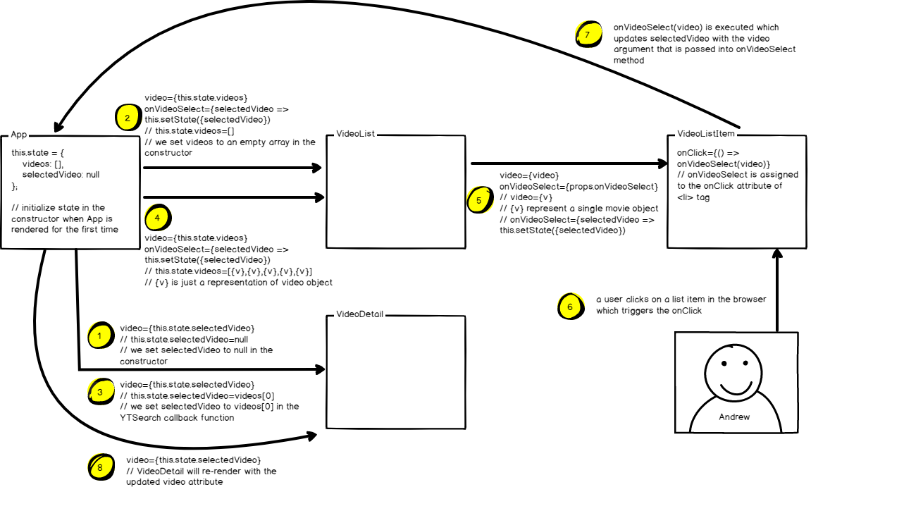

# VideoSelect React App



- 1. Grab Video Lists From Youtube API.
- 2. Selected Video from page and show it on the top of the page.
- 3. Type in texts to seach.

## Index (App) - stateful 
- State: 1. Lists of Vidoes 2. selected Vudeo
- videoSearch() finction: to change the by YTSearch Api call
- Send onSearchTermChange function into <SearchBar>
- Send onVideoSelect function into <VideoList> 
- Send selectedVideo state as props into <VideoDetail>

## SearchBar - stateful
- State: 1. the Term of users typed 2. onTnputChange recorded while user's typing
- term : pass contents into value in input (get value from props.target.value)
- onChange: pass value to onSearchTermChange to App

## VidoeList - stateless
- To get onVideoSelect function and videos(list of videos) as props from App
- Used map insteads of for loop to implement conditional render
- Pass vidoe an onVideoSelect function and one of the video(by map) to VideoListItem

```js
  const videoItems = props.videos.map(video => {
    return (
    <VideoListItem 
      onVideoSelect = {props.onVideoSelect} 
      key = {video.etag}  
      video = {video} />
    )
  });
```
- Retrun the format of ul and li 
```js
  return(
    <ul className = "col-md-8 col-lg-4  list-group" >
      {videoItems}
    </ul>
  );
}
```

## VidoeListItem - stateless
- To get onVideoSelect function and specific video as props from VideoList
- Track the Click from user and triger the onVideoSelect function
- Get the imgUrl and description from video(by using youtube api)


```js
const VideoListItem = ({video, onVideoSelect}) => {
  const imgUrl = video.snippet.thumbnails.default.url;
  return(
    <li onClick = {() => onVideoSelect(video)} className = "list-group-item">
```

- RECORD THE VIDEO "Key" (Which is quite important in the future) to recognize single one of the video instead of rending all the vidoes when we changed a specific one

```js
<VideoListItem 
      onVideoSelect = {props.onVideoSelect} // Pass to video list item
      key = {video.etag}  
      video = {video} />
```

## VideoDetail - stateless
- To get specific video clicked by the user as props from App
- Give a Url for displaying video from Youtube(embed/videoId)
```js
const videoId = video.id.videoId;
  const url = `https://www.youtube.com/embed/${videoId}`;
```

#### Handling the NULL props
- Add a check in children component to make sure it has been provided in the props before it attempts to render
```js
  if(!video) {
    return <div> Loading .... </div>
  }
```

***

## How to Update Selected Video
#### APP
- Init Video when use YTSearch not in the constructor
- State: {selectedVideo : video}
```js
  constructor(props) {
    super(props);
    this.state = { 
      videos : [],
      selectedVideo: null 
    };

    // Contents lists of Videos and setup Default video
    YTSearch({key: API_KEY, term: '徐嘉謙'}, videos => {
      this.setState({ 
        videos: videos, 
        selectedVideo: videos[0]
      })  
    });
  }
```

- onVideeoSelect function: to update the selected Video state by passing to the <VideoDetail> Component
```js
 <VideoList 
        onVideoSelect = {selectedVideo => this.setState({selectedVideo : selectedVideo}) }
        // Pass onVideoSelect as property into VideoList
        videos = {this.state.videos}/>
```

- Update the Video Detail by send state.selectedVideo data into <VidoeDetail> component
```js
 <VideoDetail video = {this.state.selectedVideo}/>
```
### Video List
- Continuouly pass the onVideoSelect function to VideoListItem
```js
onVideoSelect = {props.onVideoSelect} 
```

### Video List Item
- 1. Add onVideoSelect into the props(ES6 syntax)
- 2. Add onClick into li tag to trigger onVideoSelect function
- 3. Run the function and put props of video into onVideoSelect function

```js
const VideoListItem = ({video, onVideoSelect}) => {

 <li onClick = {() => onVideoSelect(video)} className = "list-group-item">
```

## How to Connect SearchBar and App(with otehrs Components)

- Move YTSearch to an independent videoSearch() function
```js
  videoSearch(term) {
    YTSearch({key: API_KEY, term: term}, videos => {
      this.setState({ 
        videos: videos, 
        selectedVideo: videos[0]
      })  
    });
  }
```
- Still need to init the videoSearch in the constructor

```js
 this.videoSearch('徐嘉謙');
```

- Pass a function into SearchBar
```js
<SearchBar 
        onSearchTermChange = {term => this.videoSearch(term)}/>
```

- In SerachBar : build a onInputChange function and give a onChange attribute in input tag to trigger onInputChnage() with event.target.value
```js
 onChange = {event => this.onInputChange(event.target.value))} />
 ```

 - onInputChange funciton: 1. set the state with the term and call the cal back that we got from App
 ```js
  onInputChange(term) {
    this.setState({ term });
    this.props.onSearchTermChange(term);
  }
 ```

 ## How to delay the Result when we're typing (Throttling)

- lodash npm library
```js
import _ from 'lodash';
```
- debounce: get a new value and call this function every 300 ms
```js
 const videoSearch = _.debounce((term) => { this.videoSearch(term)}, 300);
 ```
 - Change the passed value of onSerachTermChange function
 ```js
    <SearchBar 
  onSearchTermChange = {videoSearch}/>
```