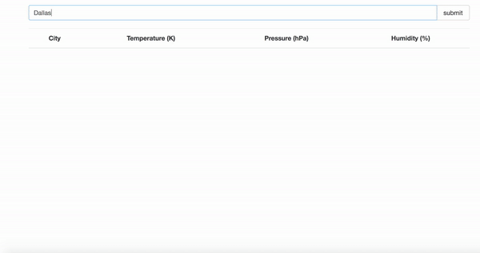
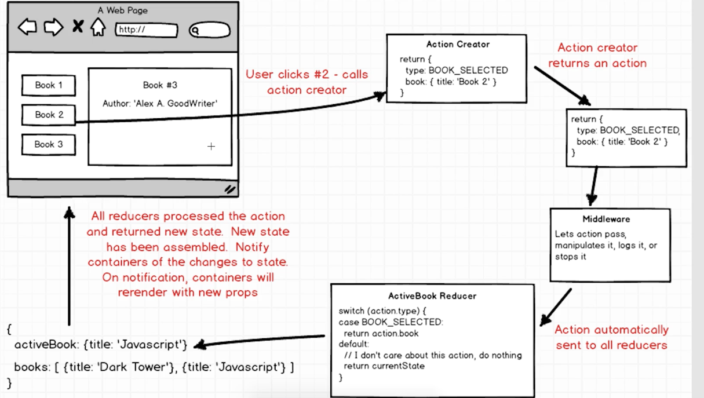
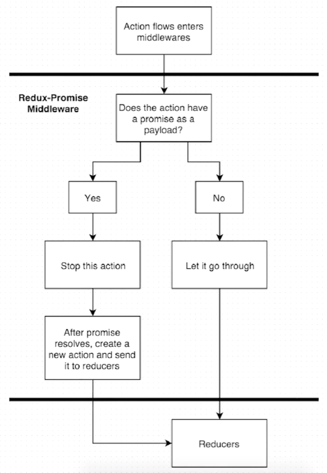
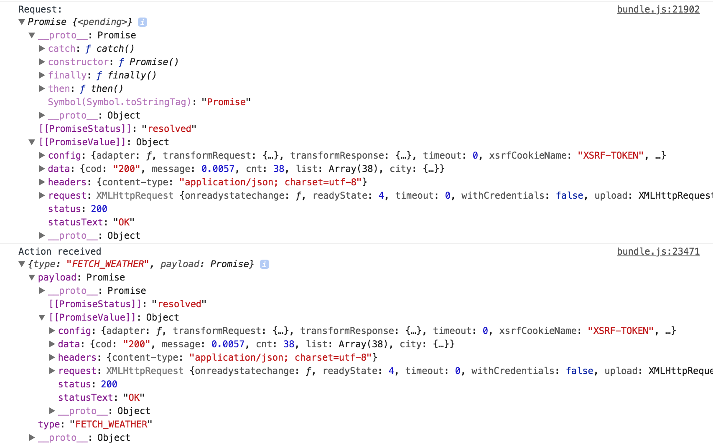
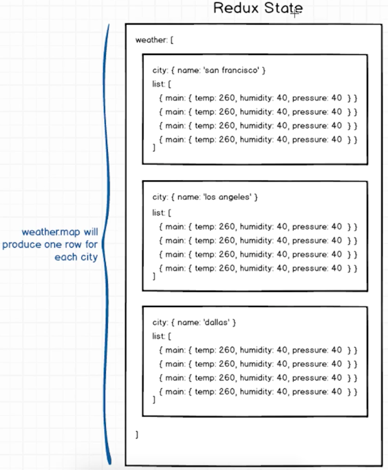

# Weather React App


### Getting Started
Checkout this repo, install dependencies, then start the gulp process with the following:

```
> git clone https://github.com/WeiChienHsu/WeatherReact.git
> cd WeatherReact
> npm install
> npm start
```

# How to make this App

## Open Weather Map API
[free API](https://openweathermap.org/api)

- API call:
```
api.openweathermap.org/data/2.5/forecast?q={city name},{country code}
```

# Action Creator

## Ajax Request on Redux (Middleware)


The Ajax request is asynchronous in nature. Normally, we have to pass a callback to it or we have to do with a promise or something like that. Redux-Promise is to help simply our codes.

#### Middleware is a DoorKeeper
Middleware is our functions that take an action. Dependin on the actions type and payload(or other values), the Middleware cound let the action pass through, manipulate the action, console.log it or stop it all together befroe actions reach any Reducer.

#### Redux Promise

Work Flow


[Redux-promise](https://www.npmjs.com/package/redux-promise)

- applyMiddleware
```js
import { createStore, applyMiddleware } from 'redux';
import ReduxPromise from 'redux-promise'


const createStoreWithMiddleware = applyMiddleware(ReduxPromise)(createStore);
```

### Action: API Request to fetch Weather API Data
- new funtion to fetch weather: In order to avoid others' typo or changes, we give a type of action not just a Strgin
- We will import this type in the reducer as well
```js
export const FETCH_WEATHER = 'FETCH_WEATHER';
```

- Template String
```js
const ROOT_URL = `http://samples.openweathermap.org/data/2.5/forecast?appid=${API_KEY}`;
```
#### axios :Library for asking Ajax Request
[axios](https://www.npmjs.com/package/axios)
- Will Return a Promise 
```js
  const request = axios.get(url);

  return {
    type: FETCH_WEATHER,
    payload: request
};
```
***

# Reducer 
- User Enter the search term they submit the form that calls the action creator(fetchWeather) and pass in the city. With the url, make an Ajax request with axio.
- Axio returns a Promise (which is a data structure that doesn't actually contain any of request data) But it return the Promise as 'payload'

### Promise and Results


#### We got a Request from Action Creator 
It's a Promise and we return it as payload

#### Instead of getting a payload from Reducer, we directly get the results data(Redux-promise unwarps the problem for us)

Redux-Promise: sees this incoming action and it looks at specifically the payload property. If paylaod is a Promise, redux-promise stop action and care about it! Once the request finishes it dispatches a new action of the same type but with a payload of the resolved request.


## Reducer to handle WeatherFetch
- Get the data from action.payload.data, since only the data here are useful for us
- Save the weather data into Array
- We don't ever manipulate state directly and that's what's happening
```js
return state.push(action.payload.data)
```
- Instead of changing the Attay(state), we would like to return completely new State
```js
return state.concat([action.payload.data]);
```

***

# Components
## Search Bar
Container: Need to have the ability to modify the state of our application by depatching action right and to call all action creator needs to say like hey someone just enter the search term, we need to call a API request.

#### onChange Event
- Event Handler : onImputChange(event)
- Need a component State to record the current Input term
- Initize the input term with ''
```js
  onInputChange(event){
    console.log(event.target.value);
    this.setState({ term: event.target.value });
  }

<input
    placeholder = " Get a five-days forecast in your favorite cities"
    className = "form-control"
    value = {this.state.term}
    onChange = {this.onInputChange}
    />
```

#### onSubimt Event
- Prevent Browser to automatically submit the from 
```js
  onFormSubmit(event){
      event.preventDefault();
  }
```

#### Bind This
- Handle the Error of 'this', Since when we write " conChange = {this.onInputChagne} ", the call back function onInputChange reference to a 'this' and the callback function doesn't know what "this" means. The 'this' is not going to be our search component. 
```
Uncaught TypeError: Cannot read property 'setState' of undefined
```
- Always bind the function when we use a callback function on our DOM
```js
this.onInputChange = this.onInputChange.bind(this);
```

### Connect Commponent to action creator
- Bind the action creator "fetchWeather()" as a property to this container as we've done
```js
import { connect } from 'react-redux';
import { bindActionCreators } from 'redux';
import { fetchWeather } from '../actions/index'

```
- BindActionCreators
```js
function mapDispatchToProps(dispatch) {
  return bindActionCreators({fetchWeather}, dispatch);
}

export default connect(null, mapDispatchToProps)(SearchBar);
```
- Fetch the Weather Data by current State(term)
```js
  this.props.fetchWeather(this.state.term);
  this.setState({ term: '' })
```


## WeatherList
- Render the List of Weather Data from Weather Reducer
- Connect Reducer with WeatherList Component
- Used the structure of table tags in HTML
```js
<table className = "table table-hober">
    <thead>
      <tr>
        <th>City</th>
        <th>Temperature</th>
        <th>Pressure</th>
        <th>Humidity</th>
      </tr>
    </thead>
    <tbody>
      
    </tbody>
  </table>
```
#### States in Redux


- RenderWeather function
```js
  renderWeather(cityData){
    return(
      <tr key = {cityData.city.id} >
        <td>{cityData.city.name}</td>
      </tr>  
    );
  }
```
#### Render the list of different temp
- map the list and go through each data inside the main, the out put will be an array of numbers(temps)

```js
const temps = cityData.list.map(weather => weather.main.temp)
```

### React Sparklines
[React Sparklines](http://borisyankov.github.io/react-sparklines/)

- Aviod Depuliacte, need to refactor our chart as a reusable component.
```js
<td>
  <Sparklines height = {120} width = {180} data = {temps}>
    <SparklinesLine color = "red"/>
  </Sparklines>
</td>
```

## Chart (Component)
- Always get the data from WeatherList so it won't connect with Redux
- Not need to be a Class, since it won't have it's own behaviors
```js
// WeatherList
<td>
  <Chart data = {temps} color = "blue" />
</td>

// Chart

<div>
  <Sparklines svgHeight={80} svgWidth={140} data = {props.data}>
      <SparklinesLine color = {props.color}/>
  </Sparklines>
</div>

```

## How to connect with CSS within babel
- install babel-plugin-css-modules-transform and add plugins option to .babelrc file

```
npm install --save-dev babel-plugin-css-modules-transform
```
```js
{
    "plugins": ["css-modules-transform"]
}
```

***

## Map Component
- Refer to google.map (Third party Library)
- Intergrate with Thrid Party Libraires
```js
  componentDidMount() {
    new google.map.Map(this.refs.map, {
      zoom: 12,
      center: {
        lat: this.props.lat,
        lng: this.props.lon
      }
    });
  }
```
- Import in WeatherList and Render GoogleMap in the Page(sending lat and lon data into GoogleMap)
```js
const { lon, lat } = cityData.city.coord;

    <td><GoogleMap lon = {lon} lat = {lat}  /></td>
```
- Add a Css Sytle

```js
td:first-of-type, td:first-of-type > div {
  height: 140px;
  width: 200px;
}
```