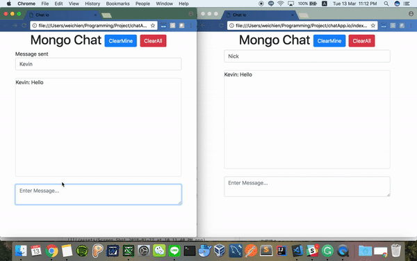

# Chat App with socket.io and MongoDB

Simple chat app that uses MongoDB and Socket.io



## Install Dependencies
```bash
npm install 
```

## Run Server
```bash
npm start
```

## Run App
Open inedx.html


***
# Design Pattern
- Add "Message" with "Username"
- Save Message into Database
- Other User can see the change at the same time
- Clear Message in Database


# Server Client

## MongoDB native node driver

```js
const MongoClient = require('mongodb').MongoClient;
const assert = require('assert');

// Connection URL
const url = 'mongodb://localhost:27017';

// Database Name
const dbName = 'myproject';

// Use connect method to connect to the server
MongoClient.connect(url, function(err, client) {
  assert.equal(null, err);
  console.log("Connected successfully to server");

  const db = client.db(dbName);

  client.close();
});
```

## Fix : MongoDB not load Bug Fixed
```js
MongoClient.connect('mongodb://localhost:27017', function(err, database){
    if(err){
      throw err;
    }
    
    console.log("MongoDB is connected!!")

    const myAwesomeDB = database.db('mongochat')

     io.on('connection', (socket) =>{

       let chat = myAwesomeDB.collection('chat');
```

## Socket.io Connectoin - Using with Node http server
```js

var app = require('http').createServer(handler)
var io = require('socket.io')(app);
var fs = require('fs');

app.listen(80);

function handler (req, res) {
  fs.readFile(__dirname + '/index.html',
  function (err, data) {
    if (err) {
      res.writeHead(500);
      return res.end('Error loading index.html');
    }

    res.writeHead(200);
    res.end(data);
  });
}

io.on('connection', function (socket) {
  socket.emit('news', { hello: 'world' });
  socket.on('my other event', function (data) {
    console.log(data);
  });
});

```

#### Client (index.html)

```html
<script src="/socket.io/socket.io.js"></script>
<script>
  var socket = io('http://localhost');
  socket.on('news', function (data) {
    console.log(data);
    socket.emit('my other event', { my: 'data' });
  });
</script>
```      


## Emit cheatsheet

The io variable represents the group of sockets. The code you have starts on line one with providing a function in the second parameter that gives you a socket variable every time a new connection is made. The socket variable is only for communicating with each individual connection. You may not see it in the code but there will be one socket variable for each connection established


```js
io.on('connect', onConnect);

function onConnect(socket){

  // sending to the client
  socket.emit('hello', 'can you hear me?', 1, 2, 'abc');

  // sending to all clients except sender
  socket.broadcast.emit('broadcast', 'hello friends!');

  // sending to all clients in 'game' room except sender
  socket.to('game').emit('nice game', "let's play a game");

  // sending to all clients in 'game1' and/or in 'game2' room, except sender
  socket.to('game1').to('game2').emit('nice game', "let's play a game (too)");

  // sending to all clients in 'game' room, including sender
  io.in('game').emit('big-announcement', 'the game will start soon');

  // sending to all clients in namespace 'myNamespace', including sender
  io.of('myNamespace').emit('bigger-announcement', 'the tournament will start soon');

  // sending to individual socketid (private message)
  socket.to(socketid).emit('hey', 'I just met you');
  
  // sending with acknowledgement
  socket.emit('question', 'do you think so?', function (answer) {});

  // sending without compression
  socket.compress(false).emit('uncompressed', "that's rough");

  // sending a message that might be dropped if the client is not ready to receive messages
  socket.volatile.emit('maybe', 'do you really need it?');

  // sending to all clients on this node (when using multiple nodes)
  io.local.emit('hi', 'my lovely babies');

};
```

***

# Client Side
- Used one element variable and then you don't need to return document.getElementById everytime you new a element

```js
<script>
    (function(){
        var element = function(id){
          return document.getElementById(id);
        }
    )()
</script>
```

- Get All Elements we need to use in frontend and backend(status\messages\username\textarea\clear)
```js
          var status = element('status');
          var messages = element('messages');
          var username = element('username');
          var textarea = element('textarea');
          var clearBtn = element('clear');
```

- Set a default status and create a setStatus function to set new sataus when server side emit status to client
- But we just need the status to exist for couple seconds, so if status didn't equal to default value we would like to clear it in 4m.

```js
  var statusDefault = status.textContent;
  var setStatus = function(s) {

    status.textContent = s;
    if(s != statusDefault){
      var delay = setTimeout(function(){
        setStatus(statusDefault);
      }, 4000);
    }
  }
```

- Connect to socket.io and Check for the connection
```js
 var socket = io.connect('http://127.0.0.1:4000');

```

- Take res from server and put it into textarea
- Both Frontend and Backend need to check if they both got a data
```js
socket.on('output',(data) => {
    if(data.length){
      for(var x = 0; x < data.length; x++) {
          var message = document.createElement('div');
          message.setAttribute('class', 'chat-message');
          message.textContent = data[x].name+": " + data[x].message;
          messages.appendChild(message);
          messages.insertBefore(message,
          messages.firstChild);
```

- Handle Input message
```js
  textarea.addEventListener('keydown', (event) => {
    if(event.which === 13 && event.shiftKey == false) {
        socket.emit('input', {
          name: username.value,
          message: textarea.value
        });
        
        event.preventDefault();
    }
  });
```

- Handle Status sent from backend(An Object or Error Message)
```js
socket.on('status',(data) => {
  setStatus((typeof data === 'object')? data.message : data);
  
  if(data.clear) {
    textarea.val = '';
  }
});
```

- Clear the all message
```js
  socket.on('cleared', () => {
    messages.textContent = '';
  });

```

***

Resources from (Traversy Media)[https://www.youtube.com/watch?v=8Y6mWhcdSUM]